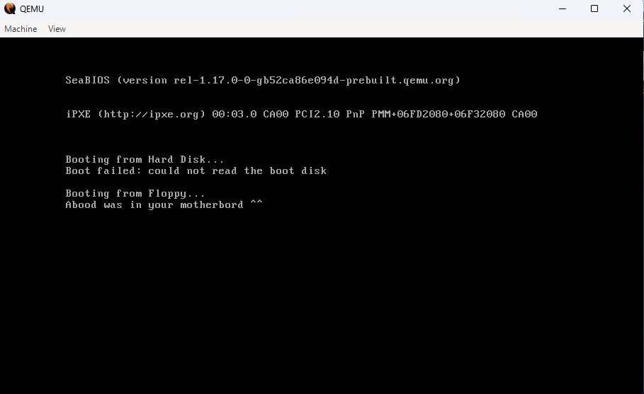

# Bare-Metal Bootkit PoC Simulator (x86 BIOS & UEFI)

A low-level **Bare-Metal Bootloader/Bootkit PoC** simulation developed in Intel Assembly (16-bit Real Mode for BIOS & 64-bit Long Mode for UEFI). This project serves as a Proof-of-Concept demonstrating how Master Boot Record (MBR) and EFI-based malware hijack the system execution flow directly from the hardware layer before any Operating System loads.

## 🚀 Features & Architecture

### 1. Legacy BIOS Mode (16-bit)
- **Zero OS Dependency:** Runs directly on Sector 0 of a Floppy emulation layer.
- **Strict Segment Initialization:** Clears `DS` via `xor ax, ax` to prevent memory offset corruption.
- **Teletype Routine:** Uses `int 0x10` (Function `0x0e`) combined with hardware string processing (`lodsb`).
- **Standard Boot Signature:** Strict 512-byte constraint with `0xAA55` magic signature.

### 2. Modern UEFI Mode (64-bit)
- **64-bit Long Mode Execution:** Explicit `[bits 64]` environment bypasses ancient real-mode limitations.
- **MS x64 Calling Convention Compliance:** Registers `RCX` and `RDX` capture the framework states.
- **Pointer Chase & Stack Alignment:** Traverses the `SystemTable` with accurate offsets (`+64` for `ConOut` and `+8` for `OutputString`) while safe-keeping the shadow space (`sub rsp, 40`).
- **Virtual FAT32 Orchestration:** Deployed as a standards-compliant `BOOTX64.EFI` binary inside a virtual FAT32 drive structure.

## 🛠️ Dev Environment & Tools
- **IDE:** Visual Studio 2019 (Platform Target: `x64` with MSVC Linker)
- **Assembler:** NASM (Netwide Assembler)
- **Emulator:** QEMU with Virtual Drive & BIOS (OVMF) configurations

## 📸 Proof of Concept (PoC)

### Legacy BIOS Execution Flow

### Modern UEFI Application Flow

## 💻 How to Run
1. Make sure **NASM** and **QEMU** are installed.
2. Edit the `.bat` file of your choice (`run.bat` for BIOS / `run2.bat` for UEFI).
3. Replace `YOUR USERNAME` with your actual Windows username.
4. Double-click the script to automatically compile, link, and launch the hardware simulation instantly!
